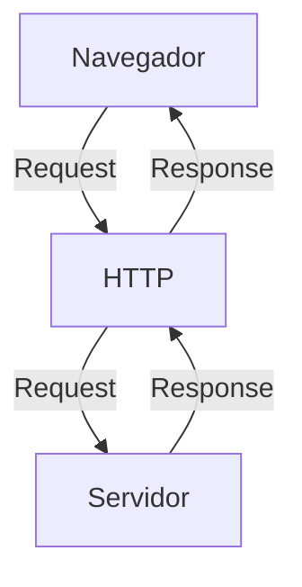
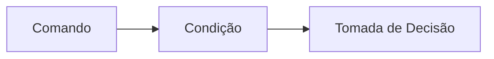
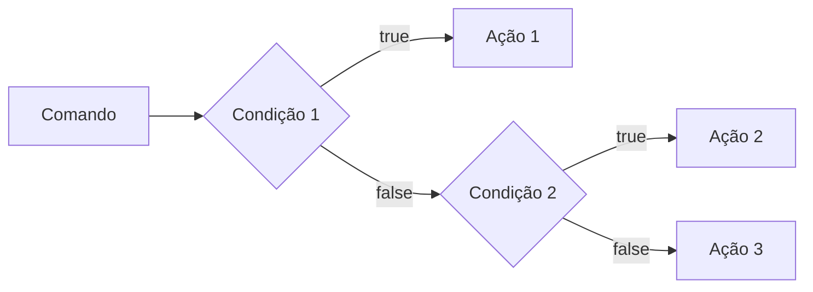

# Curso BackEnd -  1º Semestre - 105h

Prof. Diogo Barbosa

Escola SENAI Americana 

2º Semestre 2026

## Objetivos do Curso

- Desenvolver Aplicações web Server Side, utilizando a linguagem PHP;
- Aplicar Sintaxe nativa Php Vanilla;
- Manipulação HTTP;
- Persistência de Dados(Armazenamento em BD);
- Segurança contra SQL Injection/CSRF;
- Refatoração em POO (Programação Orientada Objeto);
- Arquitetura MVC;
- Utilização do FrameWork Laravel;

## Cronograma do Semestre

Carga Horária: 105h

Duração: 20 Semanas

### Semana 1: Introdução ao BackEnd e Configuração do Ambiente PHP

#### O que é BackEnd

O back-end é a parte de um site ou aplicativo que o usuário não vê, mas que faz tudo funcionar por trás das telas.

- Guarda e organiza informações em um banco de dados;
- Confere se o login e a senha estão corretos;
- Calcula valores, como o frete ou o total de uma compra;
- Garante que os dados de um usuário não apareçam para outro;
- Faz o sistema suportar muitas pessoas usando ao mesmo tempo, sem travar.

As principais linguagens utilizadas no desenvolvimento back-end são PHP, JavaScript/TypeScript, Python, Java, Kotlin, Go (Golang), C# e Rust. 

O backend é o "cérebro" oculto de um site ou aplicativo. Ele roda em um servidor e cuida de tudo o que o usuário não vê na tela.

**As 3 partes básicas de todo backend:**

1. **Servidor:** o "computador" que fica ligado esperando pedidos (requisições);
2. **Banco de dados:**  onde as informações ficam guardadas (usuários, produtos, mensagens, etc.);
3. **Lógica de negócio:**  as regras do sistema (ex: "não deixa comprar se não tiver estoque").

**O Mercado de Trabalho em Back-end**

O desenvolvimento Back-end é uma das áreas mais cruciais da Tecnologia da Informação. 

- Com a transformação digital acelerada, empresas de todos os portes e setores dependem de infraestruturas sólidas e seguras. 

- Setores de Atuação: Bancos, hospitais, e-commerces, logística, indústrias, startups e órgãos públicos utilizam Back-end para suportar suas operações críticas.

- Fatores de Crescimento: O avanço da computação em nuvem, aplicativos móveis, Big Data e IA impulsiona continuamente a busca por profissionais da área.

- Modelos de Trabalho: Alta flexibilidade com vagas presenciais, híbridas e remotas (inclusive com oportunidades internacionais).

#### Ciclo de Vida da Requsição HTTP

##### O que é HTTP

**HTTP**, Hypertext Transfer Protocol, é um protocolo de comunicação utilizado para transferência de informações na WWW(World Wide Web) e em outros sistemas de Redes.

O HTTP é a base para que o cliente e um servidor web troquem informações. Ele permite a requisição e a respostas de recursos, como imagens, arquivos e as própias páginas web, por meio de mensagens padrão (protocolo).

##### Como Funciona o HTTP

1. O cliente estabele contato com o servidor, encamihando uma requisição HTTP;
2. Nessa Requisição o cliente especifica o método pretendido (read-GET, create-POST, update-PUT/PATCH, delete-DELETE)
3. o Servidor processa e responde com uma mensagem HTTP, com os recursos solicitado.



#### Como Funciona na Prática o BackEnd

- **Ação do Usuário**: Envia uma Solicitação pela UI(Interface do Usuário). Exemplo de UI: Tela do Celular, Navegador da Internet, Alexa ...
- **Envio do Requisição**: A UI transforma ação do Usuário em uma Requisição HTTP
- **O Processamento BackEnd**: o Código Backend recebe o pedido, valida os dados e decide o que fazer (Ex: consulta uma informação no banco de dados)
- **Resposta**: O servidor devolve o resultado para a UI (Ex. Um Login Autorizado, Uma Compra Confirmada, )

#### Tipos de Requisição HTTP

Os tipos de de requisição HTTP indicam a ação que o usuário deseja executar no servidor. As principais ações são:

- **GET**: Pede dados de um lugar especifico. "Não Faz Alterações no Servidor"
- **POST**: Envia dados novos para *criar* algo ou processar informações.
- **PUT/PATCH**: Modificar dados já existentes. *PUT* Atualização Total dos dados. *PATCH* Atualização Parcial dos dados.
- **DELETE**: Apaga um dado do Servidor

---

#### Iniciando o PHP

##### O que é PHP

**PHP** (Hypertext PreProcessor) é uma liguagem de programação interpretada e open source, focada no desenvolvimento de sistemas para web, pode ser usada junto com HTML para criação de págians web dinâmicas.

##### Instalando o PHP

- Fazer o Download do PHP (php.net);
- ZIP - Non Thread Safe 8.5
- Descompactar o Arquivo do PHP na pasta C:\src\php (Para Descompactar, usar o 7Zip = Melhor) => nunca salvar arquivo na raiz do sistema(C:)
- Modificar o arquivo php.ini-development para => php.ini ( criar as configurações do PHP na Máquina) - adicionar ou remover funcionalidade do PHP
- Adicionar a Pasta do PHP(C:\src\php) as Variaveis de Ambiente do Sistema (PATH)
- verificar a instalação rodando o Comando php --version

##### Contextualizando o PHP

O PHP de fato é uma das linguagens de programação mais populares da atualizada. Ela permite que você crie aplicações web robustas, de uma maneira muito simplifica e direto ao ponto. Sem contar que a linguagem traz diversos recursos que facilitam e aceleram o processo de desenvolvimento de sites e sistemas para web. E além do mais, ela ainda tem um ótimo ecossistema, uma excelente comunidade e um grande mercado de trabalho. 

##### Criando Minha Primiera Aplicação em PHP

Criando um Hello, World!!!

##### Criando o Perfil de PHPVanilla

-> Profile -> New Profile
-> Extensions:
- PHP IntePhense ( A do Elefantinho ): AutoCompletar (Snipets)
- PHP Debug (Xdebug): Acha Erros em Linha de Código
- PHP CS FIXER: Formatação padrão do Código (Identação)
- PHP Server: Sobre um Servidor Local para Acompanhamento em Tempo Real

##### Estudo de Variáveis e Constantes em PHP

Declarar variáveis é alocar um espaço na memoria que permite a inclusão e manipulação de dados.

**Variáveis**

- devem ser declaradas usando "$" antes do nome da variável
- podem ser String, Numérica (Integer e float), Booleanas e Nulas. Não Permite declaração de Undefined
- são não tipadas ( não precisa declara o tipo na criação), a tipagem é atribuida ao adicionar o valor
- Usar o "declare(strict_types=1);" na primeira linha do arquivo ; => blindar o sistema contra conflitos de tipos de variáveis

**Constantes**

- não podem ser modificas ou redeclaradas após a criação
- pode ser criada usando "const" ou "define"
- não permitem interpolação

---

### Semana 2 - Operadores em PHP (Aritméticos, Relacionais e Lógicos)

#### Estudo de Operadores

**Aritméticos**: São usados para Realizar Cálculos.

| Operador | Nome | Exemplo | Resultado |
| - | - | - | - |
| + | Adição | 10 + 5 | 15 |
| - | Subtração | 10 - 5 | 5 |
| * | Multiplicação | 10 * 5 | 50 |
| / | Divisão | 10 / 5 | 2 |
| % | Módulo (Resto) | 10 % 3 | 1 (10 div 3 da 3, sobra 1) |
| ** | Expoente | 2 ** 3 | 8(2 elevado a 3) |

obs: O Operador % é o melhor amigo de um programador, permite ordenar listas e porganizar fila e pilhas

**Relacionais**: Permitem uma Comparação entre dois ou mais valores, o  resultado de uma operação relacional é sempre uma booleana (true , false)

| Nomes | Operador | Exemplo | Resultado |
| - | - | - | - |
| Iguais | == | "10"==10 | true | 
| Igualdade Estrita | === | "10"===10 | false | 
| Diferente | != | "10"!=10 | false |
| Diferença Estrita | !== | "10"!==10 | true |
| Maior que | > | 18 > 18 | false |
| Menor que | < | 10 < 20 | true |
| Maior ou Igual | >= | 18 >= 18 | true |
| Menor ou igual | <= | 10 <= 5 | false |

**Lógicos**: Permite a Combinação entre sentenças.

- Operador AND (E) => && : para o resultado se verdaddeiro, TODAS as Combinações precisam ser verdadeiras
    - true && true => true
    - true && false => false

- Operador OR (OU) => || : para o resultado ser verdadeiro , Basta APENAS UMA condição ser verdadeira
    - false || true => true
    - false || false => false

- Operador NOT (Não) => ! : Inverte a lógica da Sentença
    - !true => false
    - !false => true

### Semana 3 - Estrutura de Controle de Dados (Comdicionais e Repetição)  
- **Conteúdo**: Estruturas `if`, `else`, `elseif`, operadores ternários, `match` => substituto do `swicth/case`, loops `for`, `while`, `do-while` e `foreach`
 
 #### Estreuture de Comtrole de dados ajudam no processo de automação em programas e sistemas 

 ##### Condicionais (IF, ELSE, ELSEIF)

**Forma de Uso**:

- Uso do `if` apenas: 
Exemplo: aplicar um desconto de 10% em comrpas acima de 100 Reais;



```php
if ($valorCompra > 100) {
    $valorCompra = $valorCompra * 0.1
}
```

- Uso do `if` e do `else`
Exemplo: Aplicar um desconto de 10% para compras acima de 100 reais e 5% para as demais compras



```php 

if($valorCompra > 200){
    $valorFinal = $valorCompra*0.85;
} elseif($valorCompra >100) {
    $valorFinal - $valorCompra*0.9;
} else {
    $valorFinal = $valorCompra*0.95;
}
  

 ```  

*obs*: sempre usar `elseif` para situações que precisam de mais de uma condição, ou seja, fazer encadeamento das condições. 

- Uso errado do do if 

Não Fazer o Encadeamento de Condicionais 

```php  

if($valorCompra > 200) {
    $valorFinal = $valorCompra*0.85;
}
if($valorCompra > 100) {
    $valorFinal = $valorCompra*0.90;
}
if($valorCompra < 100) {
    $valorFinal = $valorCompra*0.95;
}

``` 


##### Operadores Ternários
Um atalho para a estrutura comdicional `if/else ` , normalmente escrito em uma unica linha de codigo. 
 
 ` condição  ? verdadeira : falso `

Perfeito para decições curtas de uma linha de comando 
Exemplo: Verificar se Pessoa é Maior de Idade (18)

```php 

$idade = 20;
//O formato é : (Condição) ? Verdadeiro : Falso;

$status = ($idade >= 18) ? "Maior de Idade" : "Manor de Idade";

```

##### Expressão Condicional `match` (PHP 8)

No mercado de PHP atual, não se usa mais uma dezena de `if/elseif`para checar valores fixos, e o antigo `switch/case`caiu em desuso. Usamos o `match`. Ele compara um valor e retorna diretamente o resultado.

```mermaid

graph TD
    A[valor] --> B{Condicional}
    B --> C[Ação 1]
    B --> D[Ação 2]
    B --> E[Ação 3]
    B --> F[Ação 4]
    B --> G[...]
    B --> H[Ação default]
    
    ```


  ```php 
   
   $diasemana = date("week"); //pega o dia da semana em formato Numerico  
//transformardia da esmana em Formato Texto (Domingo, segunda)   

$nomeDiaSemana = match($diaSemana){
    "0" => "Domingo",
    "1" => "Segunda",
    "2" => "Terça",
    "3" => "Quarta",
    "4" => "Quinta",
    "5" => "Sexta",
    "6" => "Sábado",
    "default" => "Dia Inválido"
};

``` 