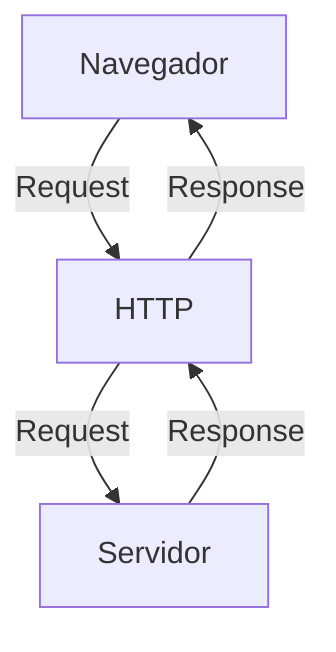

# Curso BackEnd -  1º Semestre - 105h

Prof. Diogo Barbosa

Escola SENAI Americana 

2º Semestre 2026

## Objetivos do Curso

- Desenvolver Aplicações web Server Side, utilizando a linguagem PHP;
- Aplicar Sintaxe nativa Php Vanilla;
- Manipulação HTTP;
- Persistência de Dados(Armazenamento em BD);
- Segurança contra SQL Injection/CSRF;
- Refatoração em POO (Programação Orientada Objeto);
- Arquitetura MVC;
- Utilização do FrameWork Laravel; 

## cronograma do semestre
Carga Horaria: 105h

Duraçao: 20 Semanas 

### Semana 1: introduçao ao BackEnd e comfiguraçao do anbiente PHP 

#### O que é BackEnd
back-end é a parte de um site ou aplicativo que o usuario não vé, mas que faz tudo funcionar por trás das telas.

 Guarda e organiza informações em um banco de dados;
- Confere se o login e a senha estão corretos;
- Calcula valores, como o frete ou o total de uma compra;
- Garante que os dados de um usuário não apareçam para outro;
- Faz o sistema suportar muitas pessoas usando ao mesmo tempo, sem travar.

As principais linguagens utilizadas no desenvolvimento back-end são PHP, JavaScript/TypeScript, Python, Java, Kotlin, Go (Golang), C# e Rust. 

O backend é o "cérebro" oculto de um site ou aplicativo. Ele roda em um servidor e cuida de tudo o que o usuário não vê na tela.

**As 3 partes básicas de todo backend:**

1. **Servidor:** o "computador" que fica ligado esperando pedidos (requisições);
2. **Banco de dados:**  onde as informações ficam guardadas (usuários, produtos, mensagens, etc.);
3. **Lógica de negócio:**  as regras do sistema (ex: "não deixa comprar se não tiver estoque").

*O Mercado de Trabalho em Back-end**

O desenvolvimento Back-end é uma das áreas mais cruciais da Tecnologia da Informação. 

- Com a transformação digital acelerada, empresas de todos os portes e setores dependem de infraestruturas sólidas e seguras. 

- Setores de Atuação: Bancos, hospitais, e-commerces, logística, indústrias, startups e órgãos públicos utilizam Back-end para suportar suas operações críticas.

- Fatores de Crescimento: O avanço da computação em nuvem, aplicativos móveis, Big Data e IA impulsiona continuamente a busca por profissionais da área.

- Modelos de Trabalho: Alta flexibilidade com vagas presenciais, híbridas e remotas (inclusive com oportunidades internacionais).

### ciclo de vida da requisiçao HTTP 

#### O que é HTTP 

HTTP, Hypertext Transfer Protocol, é um protocolo de comunicaçao ultilizando  para  transferencia de informaçoes na www(word wide web) e em outros sistemas de redes.

O HTTP é a base para que o cliente e um servidor web troquem informaçoes Ele permite a requisiçao  e a resposta de recursos. como imagens, aruqivos eas pro prias paginas web , por meio de mensagens padrao  (protocolo).

##### Como funciona o HTTP 

1. O cliente estabele contato com o servidor, encamihando uma requisição HTTP;
2. Nessa Requisição o cliente especifica o método pretendido (read-GET, create-POST, update-PUT/PATCH, delete-DELETE)
3. o Servidor processa e responde com uma mensagem HTTP, com os recursos solicitado.

### como funciona na pratica o backend 
 
 - A açao do Usuario : Envia uma solicitaçâo pela UI (interfaçe do usuario). Exenplo de UI:Tela do celular, Navegador da internet, Alexa ... 
 - Envio da requisição: A UI  transforma açao do usuario em uma Requisição HTTP 
 - O prosessamento Backend: o codigo Backend recebe o pedido, valida so dados e decide  oque fazer (Ex: comsulta uma  informação do banco de dados) 
 - Resposta: O servidor devolve o resultado  para a UI (EX: Um logim Autoruzado Uma Compra Confirmada,) 

  ##### Tipos de Requisição HTTP

Os tipos de de requisição HTTP indicam a ação que o usuário deseja executar no servidor. As principais ações são:

- **GET**: Pede dados de um lugar especifico. "Não Faz Alterações no Servidor"
- **POST**: Envia dados novos para *criar* algo ou processar informações.
- **PUT/PATCH**: Modificar dados já existentes. *PUT* Atualização Total dos dados. *PATCH* Atualização Parcial dos dados.
- **DELETE**: Apaga um dado do Servidor

##### niciando PHP
##### oque e  PHP
**PHP** Hypertest preprossesor e uma lingua de programaçao  interpretada e opem source , focada no desenvolvimento de sistemas web,  pode ser usada junto com html para criar paginas web dinamicas 

- Fazer o Download do PHP (php.net);
- ZIP - Non Thread Safe 8.5
- Descompactar o Arquivo do PHP na pasta C:\src\php (Para Descompactar, usar o 7Zip = Melhor) => nunca salvar arquivo na raiz do sistema(C:)
- Modificar o arquivo php.ini-development para => php.ini ( criar as configurações do PHP na Máquina) - adicionar ou remover funcionalidade do PHP
- Adicionar a Pasta do PHP(C:\src\php) as Variaveis de Ambiente do Sistema (PATH)
- verificar a instalação rodando o Comando php --version

##### Contextualizando o PHP

O PHP de fato é uma das linguagens de programação mais populares da atualizada. Ela permite que você crie aplicações web robustas, de uma maneira muito simplifica e direto ao ponto. Sem contar que a linguagem traz diversos recursos que facilitam e aceleram o processo de desenvolvimento de sites e sistemas para web. E além do mais, ela ainda tem um ótimo ecossistema, uma excelente comunidade e um grande mercado de trabalho. 

##### Criando Minha Primiera Aplicação em PHP

Criando um Hello, World!!! 

##### Criando o Perfil de PHPVanilla

-> Profile -> New Profile
-> Extensions:
- PHP IntePhense ( A do Elefantinho ): AutoCompletar (Snipets)
- PHP Debug (Xdebug): Acha Erros em Linha de Código
- PHP CS FIXER: Formatação padrão do Código (Identação)
- PHP Server: Sobre um Servidor Local para Acompanhamento em Tempo Real